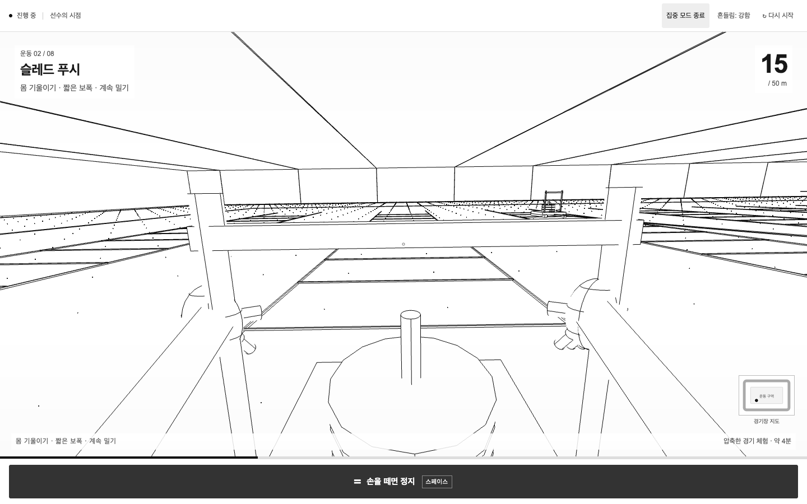
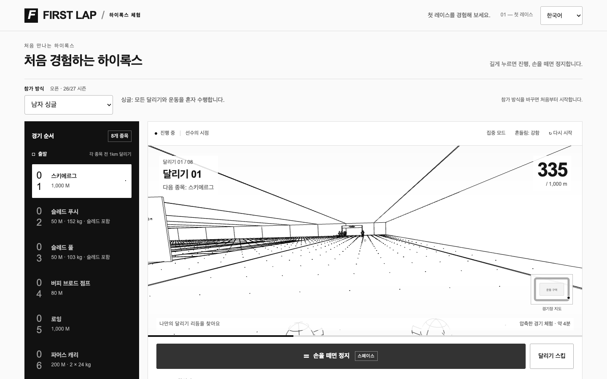
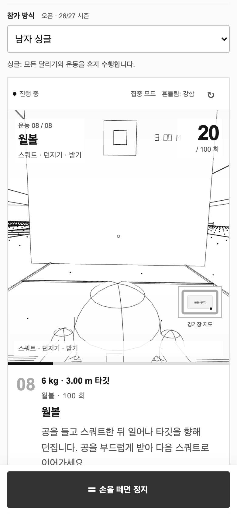
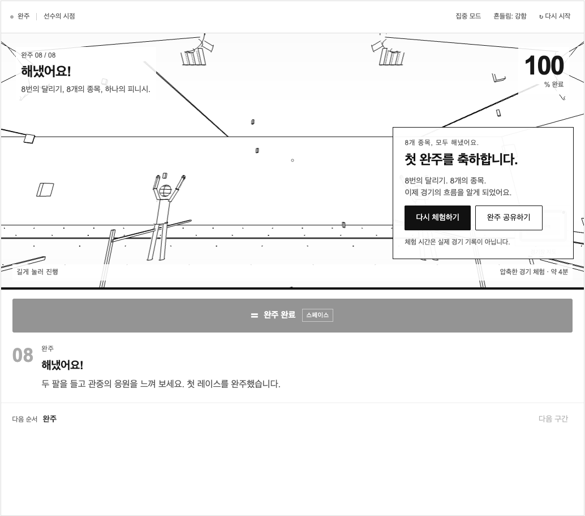
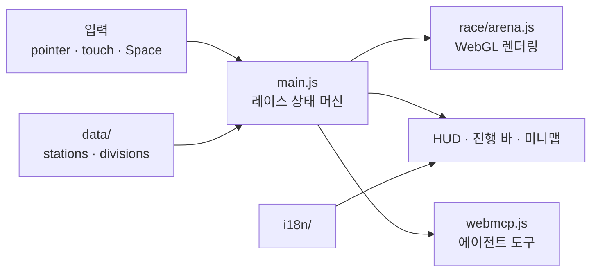
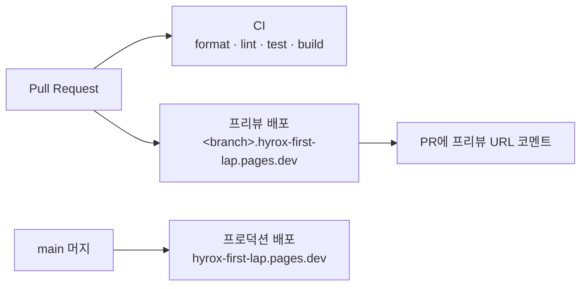

<div align="center">



# FIRST LAP

**길게 누르면 달리고, 손을 떼면 멈춥니다.**<br/>
처음 HYROX에 나가는 사람을 위한 1인칭 레이스 체험

[](https://github.com/leeseooo/hyrox-first-lap/actions/workflows/ci.yml)
[](https://github.com/leeseooo/hyrox-first-lap/actions/workflows/deploy.yml)


[](LICENSE)

[**▶ 체험하기**](https://hyrox-first-lap.pages.dev)

</div>

## 소개

HYROX는 1 km 달리기와 운동 종목 8개를 번갈아 하는 피트니스 레이스입니다.
룰북을 읽어도 실제 경기 흐름은 잘 그려지지 않아서, 경기장 안을 직접 지나가 보는 방식으로 만들었습니다.

- **1인칭 경기장**: 라이브러리 없이 WebGL로 직접 그린 아레나를 선수 시점으로 이동
- **홀드 투 무브**: 마우스·터치·스페이스바를 누르고 있는 동안만 진행 (약 4분)
- **5개 참가 방식**: 남/여 싱글, 혼성·여자·남자 더블. 시즌 26/27 공식 무게 반영
- **더블 역할 분담**: 50/50 분할로 파트너 교대와 대기 동선까지 표현
- **완주 공유**: 모바일은 공유 시트, 데스크톱은 링크 복사
- **접근성**: 한국어/English, 동작 줄이기 모드, 키보드만으로 완주 가능
- **WebMCP**: 브라우저 AI 에이전트가 레이스 상태를 읽고 조작할 수 있는 도구 제공

## 스크린샷

|                                    데스크톱                                    |                                    모바일                                    |                               완주 화면                               |
| :----------------------------------------------------------------------------: | :--------------------------------------------------------------------------: | :-------------------------------------------------------------------: |
|  |  |  |

## 기술 스택

| 영역   | 사용 기술                                             |
| ------ | ----------------------------------------------------- |
| UI     | Vanilla JS (ES Modules), HTML, CSS — 프레임워크 없음  |
| 렌더링 | WebGL 직접 구현 (선 기반 3D 아레나, 경로 보간 카메라) |
| 빌드   | Vite — 해시 파일명으로 캐시 무효화                    |
| 품질   | Vitest, ESLint, Prettier, EditorConfig                |
| 배포   | Cloudflare Pages, GitHub Actions                      |

## 아키텍처



레이스는 달리기 8개와 운동 8개, 총 16개 페이즈로 나뉩니다. 각 페이즈 안에서
`run → enter → workout (→ handoff → partner) → exit` 순서로 모드가 바뀌고,
마지막 종목 뒤에는 `finish → celebrate → complete`로 끝납니다.

## 프로젝트 구조

```text
hyrox-first-lap/
├── .github/
│   ├── workflows/
│   │   ├── ci.yml            # format · lint · test · build
│   │   └── deploy.yml        # main → 프로덕션, PR → 프리뷰 배포
│   └── pull_request_template.md
├── docs/screenshots/         # README 이미지 (npm run screenshots)
├── public/
│   ├── _headers              # CSP · 보안 헤더 · 에셋 캐시 정책
│   └── og.png                # 링크 미리보기 이미지 (1200×630)
├── scripts/
│   └── screenshots.js        # 헤드리스 Chrome으로 README·OG 이미지 생성
├── src/
│   ├── main.js               # 진입점, 레이스 상태 머신과 DOM 바인딩
│   ├── webmcp.js             # WebMCP 도구 등록
│   ├── race/
│   │   ├── arena.js          # WebGL 렌더러, 카메라·선수 포즈
│   │   └── keyboard.js       # 스페이스바 홀드 입력
│   ├── data/
│   │   ├── stations.js       # 8개 종목 정의
│   │   └── divisions.js      # 참가 방식별 무게
│   ├── i18n/index.js         # 한국어 번역
│   ├── analytics/            # 방문 통계
│   └── styles/main.css
├── tests/                    # Vitest 단위 테스트
├── index.html
├── privacy.html
├── vite.config.js
└── wrangler.toml
```

## 시작하기

Node.js 20 이상이 필요합니다.

```sh
git clone https://github.com/leeseooo/hyrox-first-lap.git
cd hyrox-first-lap
npm install
npm run dev        # http://localhost:5173
```

| 스크립트                          | 설명                                                    |
| --------------------------------- | ------------------------------------------------------- |
| `npm run dev`                     | 로컬 개발 서버                                          |
| `npm run build`                   | `dist/`로 프로덕션 빌드                                 |
| `npm run preview`                 | 빌드 결과를 Cloudflare 런타임(`_headers` 포함)으로 실행 |
| `npm test`                        | Vitest 단위 테스트                                      |
| `npm run lint` / `npm run format` | ESLint / Prettier                                       |
| `npm run screenshots`             | `npx vite preview` 실행 중에 README·OG 이미지 갱신      |

## 배포



- **프로덕션**: `main`에 머지되면 GitHub Actions가 빌드해서 Cloudflare Pages에 올립니다.
- **프리뷰**: PR마다 브랜치 이름으로 프리뷰 URL이 생기고 PR 코멘트로 링크가 달립니다. 커밋을 더 올리면 같은 코멘트가 갱신됩니다.
- **캐시**: `assets/`의 해시 파일은 1년 `immutable`, HTML은 매번 재검증합니다.
- **보안 헤더**: CSP, `X-Frame-Options`, `Permissions-Policy`, `Referrer-Policy`를 `public/_headers`로 관리합니다.
- **비용**: 정적 파일만 서빙하므로 Cloudflare Pages 무료 플랜 안에서 운영합니다.

<details>
<summary>처음 설정하는 경우</summary>

1. Cloudflare에서 `Cloudflare Pages: Edit` 권한의 API 토큰을 만듭니다.
2. 레포 **Settings → Secrets and variables → Actions**에 `CLOUDFLARE_API_TOKEN`, `CLOUDFLARE_ACCOUNT_ID`를 등록합니다.

수동으로 배포하려면 `npm run deploy`를 실행합니다.

</details>

## 면책

FIRST LAP은 HYROX와 관련 없는 비공식 학습용 프로젝트입니다.
종목 무게는 [HYROX 공식 룰북](https://hyrox.com/the-fitness-race/)(2026년 10월 1일 기준)을 따랐고, 체험 시간은 실제 경기 기록이 아닙니다.

## License

[MIT](LICENSE) © [leeseooo](https://github.com/leeseooo)
